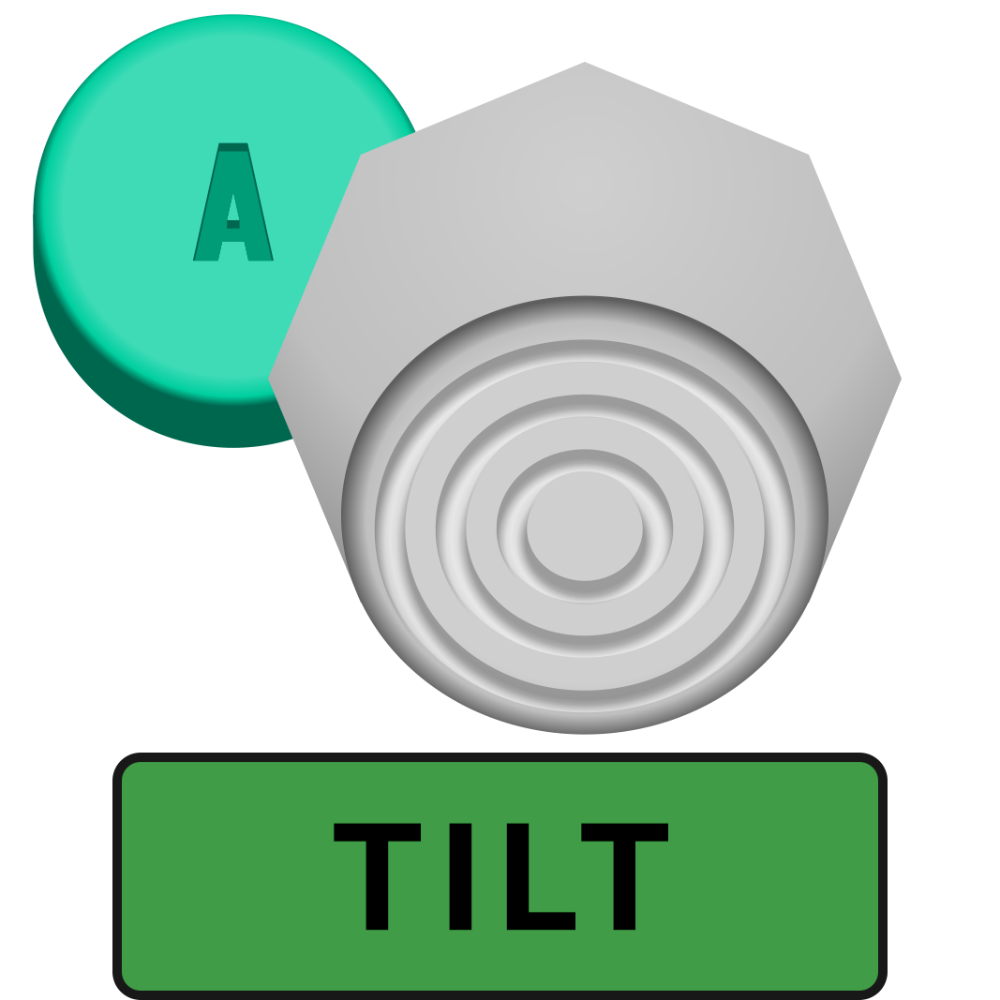

### Version 1.0 [Beta]

## Introduction

Live site: https://smash-combos.herokuapp.com/

A webapp where Super Smash Brothers Ultimate players can upload combos for any characters to share. Takes learning a new character to a whole new level!

## Features

This project is a working progress with more features to come. Here are some to name a few:

### Build your combo:

Create a customized set of combo inputs labeled with Graphics of Gamecube Controller buttons.

### Attach a responsive video:

This feature allows you to highlight sections on videos that are uploaded on Youtube and play them on repeat. Smash Combos will only allow you to attach videos that are relevant to Smash Bros content or your character selected.

### Explore combos of every character:

Share all sorts of character combos with other players and join the discussion.

## How to build a combo:

**Conditionals** are used to write these combos like a sentence, they are defined as the following:

**And**: Combines two inputs as one input

**Examples**:

_Full hop forward_

_Up smash forward DI_

_Smash forward special_

**Then**: Proceeds to the next set of inputs

**Examples**:

_Jab > jab > jab_

_Down tilt > up smash_

_Down throw bair_

**Hold**: Indicates the following input to be held

**Release**: Indicates the held button to be released

**Examples**:

_Dash forward_

_Crouch_

_Up B out of shield_

_Ground float nair_

_Charged forward smash_

_Charged forward special_

**Start Repeat**: Sets the beginning of the set of inputs that will be repeated

**End Repeat**: Indicates the end of the repeat; can be used to tell the amount of repeat times

**Examples**:

_Up tilt_

_Ground float nair x3_

_Short hop fast fall nair x3_

## YouTube Video Implementation:

In order to attach a valid YouTube video, the video has to be related to Super Smash Bros **or** your selected character. This feature will prevent unrelated videos to be attached to your combos. To submit a valid video, please grab the YouTube video ID.

**Example:**
`https://www.youtube.com/watch?v=QyCmYdgo_Ik`

**ID:** `QyCmYdgo_Ik`

**Good video:**

**Bad video:**

## Contribution

Coming soon...

## Credits

[Smash Wiki](https://www.ssbwiki.com/) : Controller buttons

[Spriters Respource](https://www.spriters-resource.com/) : Character images

[eu Samsora](https://twitter.com/Samsora_) : Videos for examples, and as a Peach main, he's my role model

[Suncoast Developers Guild](https://suncoast.io/) : Where I learned to make this app in 3 months from no experience whatsoever
