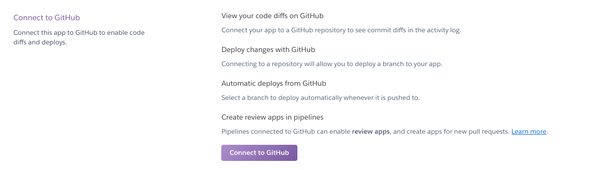
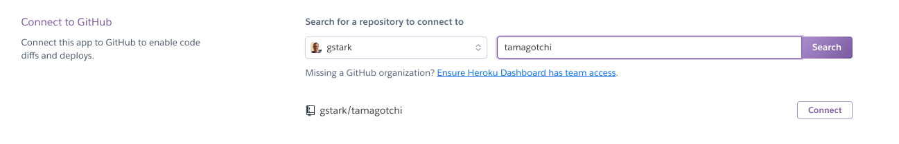
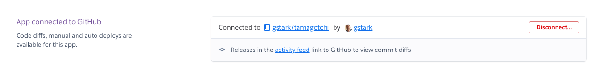
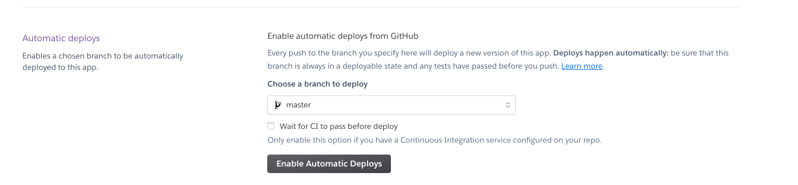

# Smash_Combos

The application was generated from the `sdg-react` template. It includes:

- CORS Enabled
- Swagger
- Postgres & EF Core
- Single Page App powered by React

## To use

The default database will be named Smash_CombosDatabase. You can change this in `DatabaseContext.cs`

## To push to github

If you selected `Y` during `dotnet new` you can add your changes and push to github with:

1. `git add .`
1. `git commit -m "Here I describe my changes"`
1. `git push`

Otherwise do the following _ONCE_ before using the steps above.

1. `git init`
1. `git add .`
1. `git commit -m "Initial Commit"`
1. `hub create`
1. `git push -u origin master`

## To deploy to Heroku

> NOTE: You must choose an app name that is unique across all of heroku. If you want to use a name that isn't available, try appending unique like `-sdg` or `-janedoe` replacing `janedoe` with your name.

- `heroku apps:create NAMEOFAPP` - NOTE: replace `NAMEOFAPP` with something that is unique to your project.
- `heroku buildpacks:add heroku/nodejs`
- `heroku buildpacks:add suncoast-devs/dotnetcore-buildpack`
- `git push heroku master`

## To open your deployed application

- `heroku open`

## To setup continuous deployment

- Visit [heroku.com](https://heroku.com) and go to the configuration page for your app
- Choose the `deploy` tab
- Select `github` as the deployment method. 
- Select `Connect to Github` 
- Browse for your repository 
- Connect to your repository 
- Enable automatic deploys 

## PROTIP:

When you are complete with the project and have turned it in to your instructor, update README.md with details about the assignment.
